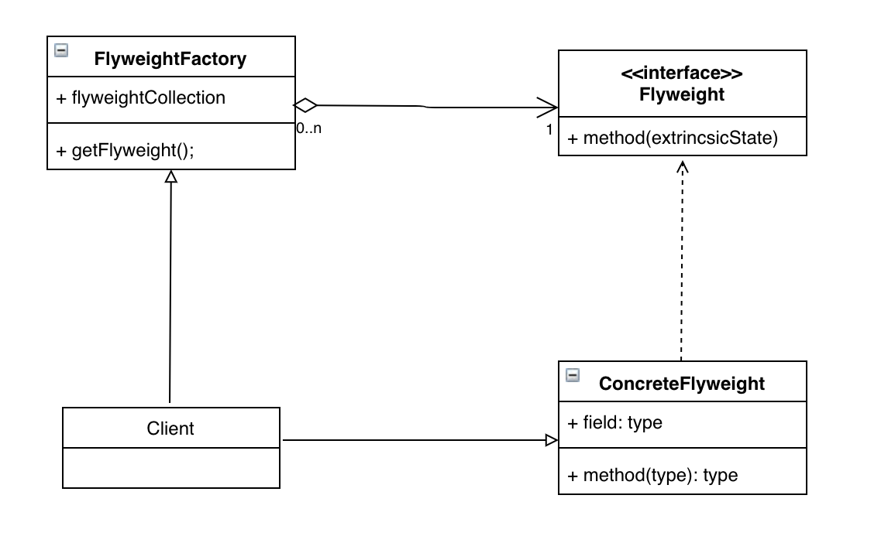

# 플라이웨이트 패턴 (Flyweight Pattern)

## 방식
클래스의 인스턴스 하나를 가지고 여러개의 가상 인스턴스를 공유하는 방법.

## 구조


1. Flyweight
    - 공유에 사용할 클래스들의 공통 인터페이스

2. ConcreteFlyweight
    - 실제 객체 생성 및 공유되는 클래스

3. FlyweightFactory
    - 객체 생성 및 공유 기능을 수행하는 클래스

## 사용하는 이유

인스턴스의 수가 줄어들기 때문에 메모리를 절약할 수 있다. 그리고 여러개의 가상 인스턴스를 한곳에 모아둘 수 있다.

## 단점

객체의 값을 변경하면 공유받은 가상 객체의 값도 변경된다. 특정 인스턴스만 따로 사용하는 것이 불가능하다.

## 예제

편의상 팩터리 메서드 패턴에서 사용했던 가렌과 애쉬를 사용하겠다.
그리고 이름 외의 수치들은 사용자가 챔피언을 픽하는 시점에서 정한다고 가정한다.

### Flyweight

``` java
public interface Character {
    public abstract void info();
}
```

### ConcreteFlyweight

``` java
public class LOLChampion implements Character {
    private String name;
    private int hp;
    private int mp;
    private int damage;
    private int speed;

    public Champion(String name){
        this.name = name;
    }

    public void setName(String name){
        this.name = name;
    }

    public void setHp(int hp){
        this.hp = hp;
    }
    
    public void setMp(int mp){
        this.mp = mp;
    }
    
    public void setDamage(int damage){
        this.damage = damage;
    }
    
    public void setSpeed(int speed){
        this.speed = speed;
    }
    
    @Override
    public void info() {
        System.out.println("롤 챔피언 정보 - 이름 : " +  champion + ", 체력 : " + hp + ", 마력 : " + mp + ", 공격력 : " + damage + ", 이동속도 : " + speed)
    }
}
```

### FlyweightFactory
``` java
public class CharacterFactory {

    private static final HashMap<String, LOLChampion> lolChampionMap = new HashMap<>();

    public static Champion pickLOLChampion(String name) {
        LOLChampion lol_champion = (LOLChampion)lolChampionMap.get(name);

        if (lol_champion_name == null){
            lol_champion = new LOLChampion(name);
            lolChampionMap.put(name, lol_champion);
            System.out.println("새로운 챔피언 등록 - " + name);
        }
        return lol_champion;
    }
}
```

### 실제 호출

``` java
    public static void main(String[] args) {
        String[] lol_champion_names = {"ashe","garen"};

        for (int i = 0; i < 2; i++){
            LOLChampion champion = (LOLChampion)CharacterFactory.pickLOLChampion(lol_champion_names[i]);
            champion.setHp(100 + 50 * i);
            champion.setMp(50 - 50 * i);
            champion.setDamage(25 + 5 * i);
            champion.setSpeed(290 + 10 * i);
            champion.info()
        }
}
```

### 실행 결과

``` java
새로운 챔피언 등록 - ashe
롤 챔피언 정보 - 이름 : ashe, 체력 = 100, 마력 = 50, 공격력 = 25, 이동속도 = 290
새로운 챔피언 등록 - garen
롤 챔피언 정보 - 이름 : ashe, 체력 = 150, 마력 = 0, 공격력 = 30, 이동속도 = 300
```